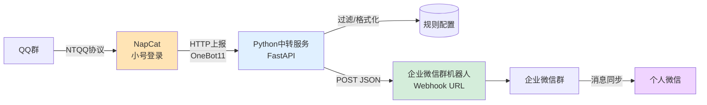

# QQ 自动转发到微信 — 完整方案文档

> 目标：监听指定 QQ 群的消息，自动、实时地转发到个人微信。
> 运行形态：Linux 云服务器 24 小时常驻运行。
> 整体把握度：90%+（详见第十章风险分析）。

---

## 目录

1. [方案总览与关键决策](#一方案总览与关键决策)
2. [整体架构](#二整体架构)
3. [技术栈说明](#三技术栈说明)
4. [准备清单（账号 / 服务器 / 工具）](#四准备清单)
5. [详细部署步骤](#五详细部署步骤)
6. [核心转发服务代码](#六核心转发服务代码)
7. [消息过滤与路由规则](#七消息过滤与路由规则)
8. [开机自启与监控](#八开机自启与监控)
9. [成本估算](#九成本估算)
10. [风险分析与应对（把握度说明）](#十风险分析与应对把握度说明)
11. [常见问题](#十一常见问题)
12. [后续可扩展功能](#十二后续可扩展功能)

---

## 一、方案总览与关键决策

### 1.1 最终方案

```
QQ群消息 ──NapCat(小号)──> HTTP上报 ──> Python中转服务 ──> 企业微信群机器人Webhook ──> 同步到个人微信
```

### 1.2 为什么是这个方案（关键决策依据）

| 维度 | 企业微信Webhook方案(推荐) | PC微信Hook方案(备选) |
|------|--------------------------|----------------------|
| 服务器要求 | Linux云服务器即可(便宜) | 必须Windows+图形界面(贵3-5倍) |
| 微信侧封号风险 | 零(官方API) | 有(PC微信Hook易被风控) |
| 24h稳定性 | 高 | 低(需PC微信常驻登录) |
| 消息能否到个人微信 | 能(企业微信→微信消息同步) | 能(直接发个人微信) |
| 部署难度 | 中 | 高 |
| 把握度 | 90%+ | 约70% |

### 1.3 个人能否申请企业微信？

**能，完全免费，无需营业执照。**

注册流程：
1. 浏览器访问 `https://work.weixin.qq.com`
2. 点击右上角"立即注册"
3. 企业类型选择 **"个人/团队"**（不要选"企业"，那个需要营业执照）
4. 填写团队名称（随意，如"我的通知"）、管理员姓名、手机号
5. 用你**现有的个人微信扫码**验证身份
6. 注册完成，得到一个"未认证企业微信"

> "未认证"不影响群机器人 Webhook 功能使用，只是成员上限和部分高级功能受限，对本方案无影响。

### 1.4 企业微信消息如何同步到个人微信

注册企业微信后，在企业微信 App 中：
- 「我」→「设置」→「消息通知」→ 开启「企业微信消息同步到微信」
- 这样群机器人推送的消息，你**个人微信会收到通知**，点开可直接查看

---

## 二、整体架构

### 2.1 架构图



### 2.2 数据流详解

1. **QQ群** 有新消息
2. **NapCat**（QQ协议端，小号登录）通过 NTQQ 协议收到消息
3. NapCat 按 OneBot 11 标准，通过 **HTTP POST 上报**到我们的中转服务
4. **Python中转服务**(FastAPI) 接收上报，判断：
   - 是否目标群？ → 不在白名单则丢弃
   - 是否需要关键词过滤？
5. 格式化消息文本（加群名、发言人前缀）
6. 调用 **企业微信群机器人 Webhook**，POST JSON 推送
7. 企业微信群收到消息 → **同步到个人微信**

### 2.3 各组件职责

| 组件 | 职责 | 运行位置 |
|------|------|----------|
| NapCat | QQ协议端，登录小号，接收QQ消息并按OneBot11上报 | 云服务器 |
| FastAPI中转服务 | 接收上报、过滤、格式化、调用微信Webhook | 云服务器 |
| 企业微信群机器人 | 接收Webhook请求，把消息发到群里 | 腾讯企业微信服务 |
| systemd | 让中转服务开机自启、崩溃自动重启 | 云服务器 |
| (可选) supervisord/PM2 | 管理NapCat进程 | 云服务器 |

---

## 三、技术栈说明

### 3.1 NapCat（QQ协议端）

- **是什么**：基于 NTQQ 协议的 OneBot 11 协议实现，纯 Node.js，无需图形界面
- **为什么选它**：目前社区最活跃的 NTQQ 协议端，支持 Linux 无头运行，适合服务器部署
- **官网/仓库**：`https://github.com/NapNeko/NapCatQQ`
- **风险**：第三方协议，小号有风控概率（偶发掉线，需重新扫码登录）

### 3.2 Python + FastAPI（中转服务）

- **为什么选FastAPI**：异步、轻量、自带文档、处理HTTP上报天然合适
- **依赖**：`fastapi`、`uvicorn`、`httpx`、`pydantic`

### 3.3 企业微信群机器人 Webhook

- **是什么**：企业微信群里的机器人，提供一个 URL，POST JSON 即可发消息
- **限制**：每个机器人每分钟最多20条消息；单条消息文本最长4096字节
- **费用**：完全免费

### 3.4 运行环境

- **操作系统**：Ubuntu 22.04 LTS（推荐）/ Debian 12 / CentOS 9
- **Python**：3.10+
- **Node.js**：18+（NapCat依赖）

---

## 四、准备清单

### 4.1 账号准备

| 项目 | 说明 | 必须 |
|------|------|------|
| QQ小号 | 专用小号，**不要用主号**，承担第三方协议风险 | ✅ |
| QQ小号已加群 | 小号要加入你想转发的QQ群 | ✅ |
| 企业微信 | 个人注册（见1.3），免费 | ✅ |
| 云服务器账号 | 阿里云/腾讯云/华为云任选 | ✅ |
| 个人微信 | 用于接收企业微信同步的消息 | ✅ |

### 4.2 服务器准备

**最低配置：**
- CPU：1核
- 内存：2GB（NapCat约占300-500MB）
- 系统盘：40GB SSD
- 带宽：1-3Mbps（转发文本流量极小）
- 系统：Ubuntu 22.04 LTS

**推荐厂商与规格：**
| 厂商 | 推荐产品 | 参考月费 |
|------|----------|----------|
| 阿里云 | 轻量应用服务器 2核2G | 约60-100元/月 |
| 腾讯云 | 轻量应用服务器 2核2G | 约50-90元/月 |
| 华为云 | Flexus云服务器 2核2G | 约50-80元/月 |

> 新用户首年常有优惠（如99元/年），可关注活动。

### 4.3 工具软件清单

- NapCat（QQ协议端，GitHub下载）
- Python 3.10+
- Node.js 18+
- pm2（管理NapCat进程，可选）
- git（拉取代码）
- 一个顺手的编辑器（本地写代码用VSCode）

---

## 五、详细部署步骤

### 5.1 第一步：注册企业微信并创建群机器人

1. **注册企业微信**（见1.3节），完成实名验证

2. **创建一个群**：
   - 企业微信App → 「通讯录」→ 自己加自己（一个人也行）
   - 或「消息」→ 右上角「+」→「发起群聊」→ 即使一个人也能建一个群
   - 群名随意，如"QQ转发通知"

3. **添加群机器人**：
   - 进入群 → 右上角「...」→「群机器人」→「添加」→「新创建一个机器人」
   - 机器人起名"QQ转发"
   - 创建后会得到一个 **Webhook URL**，格式如：
     ```
     https://qyapi.weixin.qq.com/cgi-bin/webhook/send?key=xxxxxxxx-xxxx-xxxx-xxxx-xxxxxxxxxxxx
     ```
   - **保存好这个URL，后续要用**

4. **测试Webhook**（用curl验证可用）：
   ```bash
   curl 'https://qyapi.weixin.qq.com/cgi-bin/webhook/send?key=你的KEY' \
      -H 'Content-Type: application/json' \
      -d '{"msgtype":"text","text":{"content":"测试消息：企业微信机器人配置成功！"}}'
   ```
   群里应该收到"测试消息"，说明Webhook可用。

5. **开启消息同步到个人微信**：
   - 企业微信App →「我」→「设置」→「消息通知」
   - 开启「企业微信消息同步到微信」

### 5.2 第二步：云服务器初始化

1. **购买并登录服务器**（购买时记下公网IP、root密码）

2. **SSH连接**（本地终端）：
   ```bash
   ssh root@你的服务器公网IP
   ```

3. **更新系统、安装基础工具**：
   ```bash
   apt update && apt upgrade -y
   apt install -y git curl wget vim unzip build-essential
   ```

4. **安装 Node.js 18**（NapCat依赖）：
   ```bash
   curl -fsSL https://deb.nodesource.com/setup_18.x | bash -
   apt install -y nodejs
   node -v  # 验证，应输出 v18.x.x
   ```

5. **安装 Python 3.10+**：
   ```bash
   apt install -y python3 python3-pip python3-venv
   python3 --version  # 验证
   ```

6. **安装 pm2**（用于管理NapCat进程）：
   ```bash
   npm install -g pm2
   ```

7. **开放端口**（用于首次扫码登录和Webhook回调）：
   - 云服务器控制台「安全组」放行端口 `6099`（NapCat WebUI）、`8080`（中转服务）
   - Ubuntu防火墙：
     ```bash
     ufw allow 6099/tcp
     ufw allow 8080/tcp
     ```

### 5.3 第三步：部署 NapCat 接收QQ消息

1. **下载 NapCat**（查看GitHub Release获取最新版链接）：
   ```bash
   mkdir -p /opt/napcat && cd /opt/napcat
   # 以Shell版为例（适合无头服务器），具体下载地址以官方Release为准
   wget https://github.com/NapNeko/NapCatQQ/releases/latest/download/NapCat.Shell.zip
   unzip NapCat.Shell.zip
   ```

2. **首次启动并扫码登录**：
   ```bash
   cd /opt/napcat
   # 启动NapCat，首次会输出二维码
   npm run start  # 或官方文档指定的启动命令
   ```
   - 用 **QQ小号** 扫描终端输出的二维码登录
   - 登录成功后 NapCat 会保持会话

3. **配置 OneBot 11 HTTP 上报**（关键）：
   - 编辑 NapCat 的 `config/onebot11.json`（路径以实际版本为准）：
     ```json
     {
       "http": {
         "enable": false
       },
       "httpServers": [],
       "httpServers": [],
       "httpClient": {
         "enable": true,
         "url": "http://127.0.0.1:8080/onebot/event",
         "messagePostFormat": "array",
         "reportSelfMessage": false
       },
       "debug": false,
       "heartInterval": 30000,
       "token": ""
     }
     ```
   - 这表示：NapCat收到消息后，会POST到 `http://127.0.0.1:8080/onebot/event`
   - 即我们的Python中转服务

4. **用 pm2 守护 NapCat 进程**：
   ```bash
   cd /opt/napcat
   pm2 start npm --name napcat -- run start
   pm2 save
   pm2 startup  # 按提示执行输出的命令，实现开机自启
   ```

5. **验证**：在QQ群里发一条消息，观察NapCat日志：
   ```bash
   pm2 logs napcat
   ```
   应能看到消息事件输出。

### 5.4 第四步：部署中转转发服务

1. **创建项目目录**：
   ```bash
   mkdir -p /opt/qq-forward && cd /opt/qq-forward
   python3 -m venv venv
   source venv/bin/activate
   ```

2. **创建依赖文件 `requirements.txt`**：
   ```
   fastapi==0.110.0
   uvicorn==0.29.0
   httpx==0.27.0
   pydantic==2.6.4
   ```

3. **安装依赖**：
   ```bash
   pip install -r requirements.txt
   ```

4. **创建配置文件 `config.py`**（见第六章代码）

5. **创建主程序 `main.py`**（见第六章代码）

6. **用 pm2 启动中转服务**：
   ```bash
   pm2 start "venv/bin/uvicorn main:app --host 0.0.0.0 --port 8080" --name qq-forward
   pm2 save
   ```

### 5.5 第五步：端到端测试

1. 确认两个服务都在运行：
   ```bash
   pm2 list
   # 应看到 napcat 和 qq-forward 都是 online
   ```

2. 在目标QQ群发一条消息

3. 检查企业微信群是否收到转发

4. 查看日志定位问题：
   ```bash
   pm2 logs qq-forward  # 中转服务日志
   pm2 logs napcat      # QQ协议端日志
   ```

---

## 六、核心转发服务代码

### 6.1 `config.py` — 配置文件

```python
# config.py
"""QQ转发到微信的配置"""

# ============ 企业微信 Webhook ============
# 替换为你自己的群机器人Webhook URL（5.1节第3步获取）
WECHAT_WEBHOOK_URL = "https://qyapi.weixin.qq.com/cgi-bin/webhook/send?key=替换为你的KEY"

# ============ QQ群白名单 ============
# 只转发这些群的消息（填群号，可多个）
# 留空 [] 表示转发所有群
TARGET_GROUP_IDS = [
    123456789,   # 示例：替换为你要转发的群号
    987654321,
]

# ============ 关键词过滤（可选） ============
# 只转发包含以下任一关键词的消息；留空 [] 表示不过滤，全部转发
KEYWORDS = [
    # "报名", "通知", "重要",
]

# ============ 消息类型白名单 ============
# 支持转发的消息类型
SUPPORTED_MSG_TYPES = ["text", "image", "at", "reply"]

# ============ 行为开关 ============
# 是否在转发消息前加上群名和发言人
ADD_SENDER_PREFIX = True
# 忽略机器人自己发的消息
IGNORE_SELF_MESSAGE = True

# ============ 频率限制 ============
# 企业微信Webhook每分钟最多20条，做简单限流
MAX_MSG_PER_MINUTE = 18  # 留点余量
```

### 6.2 `main.py` — 主程序

```python
# main.py
"""QQ消息转发到企业微信群机器人的中转服务"""
import time
from collections import deque
from typing import Any

import httpx
from fastapi import FastAPI, Request
from fastapi.responses import JSONResponse

import config

app = FastAPI(title="QQ Forward to WeChat")

# 简单滑动窗口限流（60秒内最多N条）
_msg_timestamps: deque = deque()


def _rate_limited() -> bool:
    """返回True表示被限流"""
    now = time.time()
    while _msg_timestamps and now - _msg_timestamps[0] > 60:
        _msg_timestamps.popleft()
    if len(_msg_timestamps) >= config.MAX_MSG_PER_MINUTE:
        return True
    _msg_timestamps.append(now)
    return False


def _extract_text(message: list[dict] | str) -> str:
    """从OneBot11的message数组中提取纯文本"""
    if isinstance(message, str):
        return message
    parts = []
    for seg in message:
        t = seg.get("type")
        d = seg.get("data", {})
        if t == "text":
            parts.append(d.get("text", ""))
        elif t == "at":
            qq = d.get("qq", "")
            parts.append(f"@{qq}" if qq else "@某人")
        elif t == "image":
            url = d.get("url", "")
            parts.append(f"[图片:{url[:50]}...]" if url else "[图片]")
        elif t == "reply":
            parts.append("[回复]")
        elif t == "face":
            parts.append(f"[表情{d.get('id', '')}]")
        else:
            parts.append(f"[{t}]")
    return "".join(parts).strip()


def _match_keywords(text: str) -> bool:
    """配置了关键词时，返回是否匹配；未配置关键词返回True(全部放行)"""
    if not config.KEYWORDS:
        return True
    return any(kw in text for kw in config.KEYWORDS)


async def _send_to_wechat(content: str) -> bool:
    """调用企业微信Webhook发送文本消息"""
    if not content:
        return False
    payload = {"msgtype": "text", "text": {"content": content[:4000]}}  # 截断防超长
    try:
        async with httpx.AsyncClient(timeout=10) as client:
            resp = await client.post(config.WECHAT_WEBHOOK_URL, json=payload)
            data = resp.json()
            if data.get("errcode", 0) != 0:
                print(f"[微信发送失败] {data}")
                return False
            return True
    except Exception as e:
        print(f"[微信发送异常] {e}")
        return False


@app.post("/onebot/event")
async def handle_onebot_event(request: Request) -> JSONResponse:
    """接收NapCat的OneBot11 HTTP上报"""
    try:
        data: dict[str, Any] = await request.json()
    except Exception:
        return JSONResponse({"status": "ignore"})

    # 心跳包直接忽略
    if data.get("post_type") == "meta_event":
        return JSONResponse({"status": "ok"})

    # 只处理消息事件
    if data.get("post_type") != "message":
        return JSONResponse({"status": "ignore"})

    # 只处理群消息
    if data.get("message_type") != "group":
        return JSONResponse({"status": "ignore"})

    group_id = data.get("group_id")
    sender = data.get("sender", {})
    user_id = data.get("user_id")

    # 忽略自己发的消息
    if config.IGNORE_SELF_MESSAGE and data.get("self_id") == user_id:
        return JSONResponse({"status": "ignore_self"})

    # 群白名单过滤
    if config.TARGET_GROUP_IDS and group_id not in config.TARGET_GROUP_IDS:
        return JSONResponse({"status": "filtered_group"})

    # 提取文本
    text = _extract_text(data.get("message", ""))
    if not text:
        return JSONResponse({"status": "empty_text"})

    # 关键词过滤
    if not _match_keywords(text):
        return JSONResponse({"status": "filtered_keyword"})

    # 限流
    if _rate_limited():
        print("[限流] 消息过多，丢弃本条")
        return JSONResponse({"status": "rate_limited"})

    # 格式化消息
    if config.ADD_SENDER_PREFIX:
        group_name = data.get("group_name") or str(group_id)
        nickname = sender.get("nickname") or sender.get("card") or str(user_id)
        content = f"【{group_name}】{nickname}:\n{text}"
    else:
        content = text

    # 发送到企业微信
    ok = await _send_to_wechat(content)
    return JSONResponse({"status": "ok" if ok else "send_failed"})


@app.get("/health")
async def health():
    return {"status": "ok", "service": "qq-forward"}
```

### 6.3 关键说明

- **接收端点**：`POST /onebot/event`，与5.3节NapCat配置的 `httpClient.url` 一致
- **消息提取**：支持文本、@、图片（转链接）、表情，其他类型降级为占位符
- **限流**：滑动窗口60秒18条，留余量避免触发企业微信20条/分钟限制
- **失败处理**：打印日志，不阻塞NapCat上报

---

## 七、消息过滤与路由规则

当前配置支持三种过滤维度，在 `config.py` 中调整：

| 过滤维度 | 配置项 | 说明 |
|----------|--------|------|
| 群白名单 | `TARGET_GROUP_IDS` | 只转发指定群，空数组=全部群 |
| 关键词过滤 | `KEYWORDS` | 只转发含关键词的消息，空数组=不过滤 |
| 忽略自己 | `IGNORE_SELF_MESSAGE` | 不转发机器人小号自己发的消息 |

**进阶路由（需扩展代码）：**
- 不同群转发到不同企业微信群（需配置多个Webhook）
- 图片/文件单独下载后用企业微信"image"类型推送（需扩展 NapCat 文件下载逻辑）
- 按发言人黑名单过滤
- 消息去重（防止重复转发）

---

## 八、开机自启与监控

### 8.1 使用 pm2 管理两个进程

```bash
# 查看进程
pm2 list

# 查看日志
pm2 logs
pm2 logs qq-forward --lines 100
pm2 logs napcat --lines 100

# 重启
pm2 restart qq-forward
pm2 restart napcat

# 保存开机自启配置
pm2 save
pm2 startup  # 执行输出的命令
```

### 8.2 健康检查脚本（可选）

创建 `/opt/qq-forward/check.sh`：
```bash
#!/bin/bash
# 检查中转服务是否存活，挂了就重启
if ! curl -s http://127.0.0.1:8080/health > /dev/null; then
    pm2 restart qq-forward
    echo "$(date) qq-forward 重启" >> /var/log/qq-forward-check.log
fi
```

加到 crontab：
```bash
crontab -e
# 添加（每5分钟检查一次）
*/5 * * * * /opt/qq-forward/check.sh
```

### 8.3 日志查看

```bash
pm2 logs            # 所有日志
pm2 logs --lines 200
# 日志默认在 ~/.pm2/logs/
```

---

## 九、成本估算

### 9.1 一次性成本

| 项目 | 费用 |
|------|------|
| 企业微信注册 | 0元 |
| QQ小号 | 0元（用现有的或注册新号） |

### 9.2 月度成本

| 项目 | 月费 | 说明 |
|------|------|------|
| 云服务器 | 50-100元 | 轻量2核2G，新用户首年常有99元/年优惠 |
| 域名（可选） | 0-10元 | 不用域名直接用IP也行 |
| **合计** | **50-100元/月** | 新用户优惠期可低至10元/月 |

> 强烈建议新用户买年付套餐，性价比最高（通常99-199元/年）。

---

## 十、风险分析与应对（把握度说明）

### 10.1 把握度评估

| 环节 | 把握度 | 风险点 |
|------|--------|--------|
| NapCat接收QQ群消息 | 90% | 小号偶发风控掉线 |
| FastAPI中转服务 | 99% | 纯本地代码，无外部不确定性 |
| 企业微信Webhook推送 | 99% | 官方API，稳定 |
| 企业微信→个人微信同步 | 95% | 依赖企业微信App通知设置 |
| 服务器24h运行 | 95% | 成熟方案 |
| **整体** | **90%+** | 主要不确定性在QQ小号 |

### 10.2 主要风险与应对

#### 风险1：QQ小号被风控/掉线
- **表现**：NapCat日志提示"登录失效"，停止接收消息
- **应对**：
  - 用小号不用主号
  - 小号平时正常使用几天再挂机器人，养号
  - 掉线后用 pm2 重启 NapCat 重新扫码登录
  - 设置健康检查脚本，检测到掉线自动发企业微信通知提醒你重新登录

#### 风险2：企业微信Webhook频率限制
- **限制**：每分钟20条/机器人
- **应对**：
  - 代码已内置限流（18条/分钟）
  - 超高频群可创建多个机器人分流，或合并相近消息批量发送
  - 用企业微信"markdown"消息类型把多条消息合并成一条

#### 风险3：服务器宕机
- **应对**：pm2 + 健康检查脚本 + crontab，崩溃自动重启

#### 风险4：NapCat官方停止维护
- **应对**：社区协议端有多个替代品（Lagrange、LLOneBot等），接口均遵循OneBot11，中转服务代码可无缝切换

### 10.3 把握度不达100%的部分

- **QQ小号长期稳定性**：腾讯对第三方协议的风控策略会变化，无法100%保证小号永不被限制
- **企业微信→个人微信同步**：依赖企业微信App的通知设置和腾讯产品策略
- **图片/文件转发**：当前代码仅支持文本+图片URL，完整文件转发需要额外开发下载逻辑

---

## 十一、常见问题

### Q1：NapCat登录后过几天掉线怎么办？
A：第三方协议的通病。用 `pm2 restart napcat` 重启，扫描终端输出的新二维码重新登录。建议小号平时偶尔正常使用，降低风控概率。

### Q2：企业微信群只有我一个人，能加机器人吗？
A：能。企业微信一个人也能建群，群机器人功能与人数无关。

### Q3：能转发图片和文件吗？
A：当前代码仅转文本（图片会转成URL占位符）。完整图片转发需要：NapCat下载图片 → 上传到企业微信临时素材接口 → 用image类型推送。属于进阶功能，需要再开发。

### Q4：能转发到多个企业微信群吗？
A：能。配置多个Webhook URL，代码中按群号路由到不同Webhook即可。

### Q5：QQ群消息太多会被刷屏吗？
A：会。建议配置关键词过滤（`KEYWORDS`）只转发重要消息，或用企业微信"消息免打扰"避免打扰。

### Q6：服务器要备案吗？
A：不用。本方案只用IP，不绑定域名，不开放80/443端口提供对外网站服务，无需ICP备案。

### Q7：能不能不用云服务器，用家里电脑？
A：能。但需要家里电脑24小时开机+有公网IP或做内网穿透。云服务器更省心，推荐云服务器。

### Q8：NapCat 和 Lagrange 怎么选？
A：两者都是NTQQ协议端，接口都遵循OneBot11。NapCat社区更活跃、文档更全，新手推荐NapCat。Lagrange更轻量，技术用户可选。

---

## 十二、后续可扩展功能

实现基础转发后，可按需扩展：

1. **多目标路由**：不同QQ群转发到不同企业微信群
2. **富媒体转发**：图片、文件、表情包完整转发
3. **消息去重**：相同内容短时间内只转发一次
4. **AI摘要**：用大模型对长消息做摘要后再转发
5. **关键词告警**：特定关键词（如"报警""故障"）加急推送（@所有人或电话通知）
6. **Web管理面板**：可视化配置群白名单、关键词，不用改代码
7. **双向互通**：在企业微信群回复消息，反向发送到QQ群（需要企业微信回调）
8. **历史消息存档**：转发的同时存入数据库，便于检索
9. **多账号负载均衡**：多个QQ小号轮询，降低单号风控风险
10. **状态监控告警**：服务异常自动发企业微信通知

---

## 附录：部署快速检查清单

完成下列所有项即可上线：

- [ ] 企业微信已注册（个人类型）
- [ ] 企业微信群已创建，机器人Webhook URL已保存
- [ ] Webhook已用curl测试可发消息
- [ ] 企业微信→个人微信消息同步已开启
- [ ] QQ小号已注册并加入目标群
- [ ] 云服务器已购买，SSH可登录
- [ ] Node.js 18+ 已安装
- [ ] Python 3.10+ 已安装
- [ ] pm2 已安装
- [ ] NapCat 已部署，小号已扫码登录
- [ ] NapCat HTTP上报已配置到 `http://127.0.0.1:8080/onebot/event`
- [ ] 中转服务代码已上传，依赖已安装
- [ ] `config.py` 中 WECHAT_WEBHOOK_URL、TARGET_GROUP_IDS 已改
- [ ] pm2 已启动 napcat 和 qq-forward 两个进程
- [ ] pm2 save + pm2 startup 已执行
- [ ] 端到端测试：QQ群发消息，企业微信群收到

---

*文档版本：v1.0*
*最后更新：2026-08-08*
